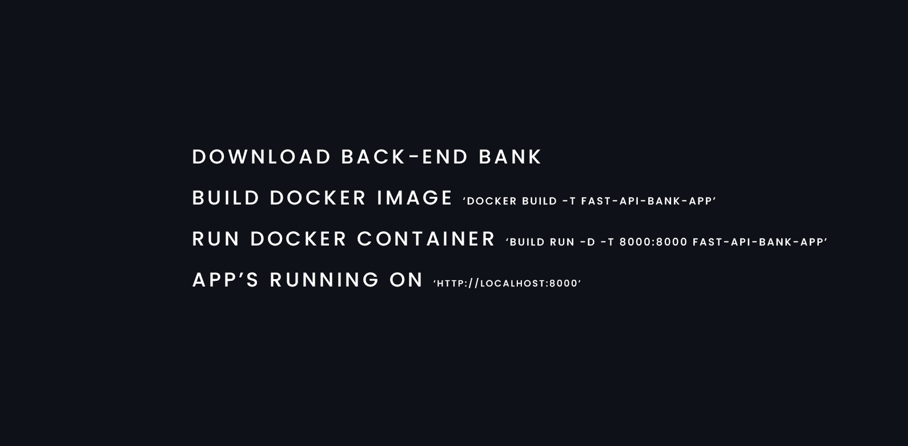

---


---

[](https://github.com/WolfangHerrera/FAST-API-BANK-APP)

---


---


---



---


---


---


---


```sh
curl -X POST 'http://localhost:8000/accounts' \
--header 'Content-Type: application/json' \
--data '{
    "name": "Wolfang",
    "last_name": "Herrera",
    "dni": 1025520565
}'
```

```sh
{
    "account_id": "1025452"
}
```

---


```sh
curl -X GET 'http://localhost:8000/accounts'
```

```sh
[
    {
        "account_id": "1025452",
        "balance": 6000000.0
    },
    {
        "account_id": "1001274",
        "balance": 6600000.0
    }
]
```

---


```sh
curl -X PATCH 'http://localhost:8000/accounts/{account_id}' \
--header 'Content-Type: application/json' \
--data '{
    "balance" : 500000
}'
```

```sh
{
    "message": "The account balance has been updated"
}
```

---


